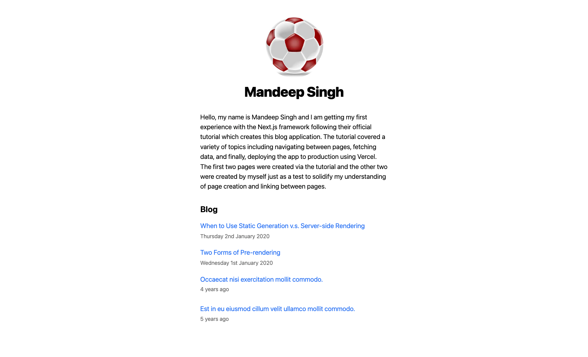
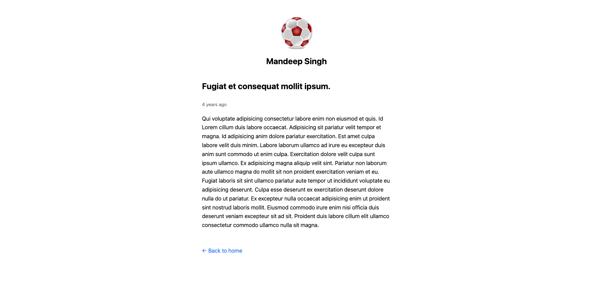

# **Next.js Blog**

## <ins>Summary</ins>

This is a application built using Next.js and Javascript as part of the official Next.js tutorial.

The purpose of this project was to dive into Next.js for the first time and gain an understanding of the fundamentals including how to host it on Vercel.

---

## <ins>Hosted Version</ins>

Can be found here - https://nextjs-tutorial-blog-application.vercel.app/

---

## <ins>Screenshots</ins>

---

## <ins>Tech Stack</ins>

- CSS
- JavaScript
- Next.js

---

## <ins>Local Setup</ins>

1. To clone the repo, open up your terminal and run `git clone https://github.com/mandeep-s1ngh/nextjs-tutorial-blog-application.git` - once you have it cloned, move the folder to your usual directory for projects (if necessary).

2. You can then open up the folder in your code editor of choice and run `npm install` to install all the dependencies.

3. Then run `npm run dev`. This will start the app and keep it running in the background whilst you make any changes. You should get a localhost address you can open in the browser to view the dev server.
